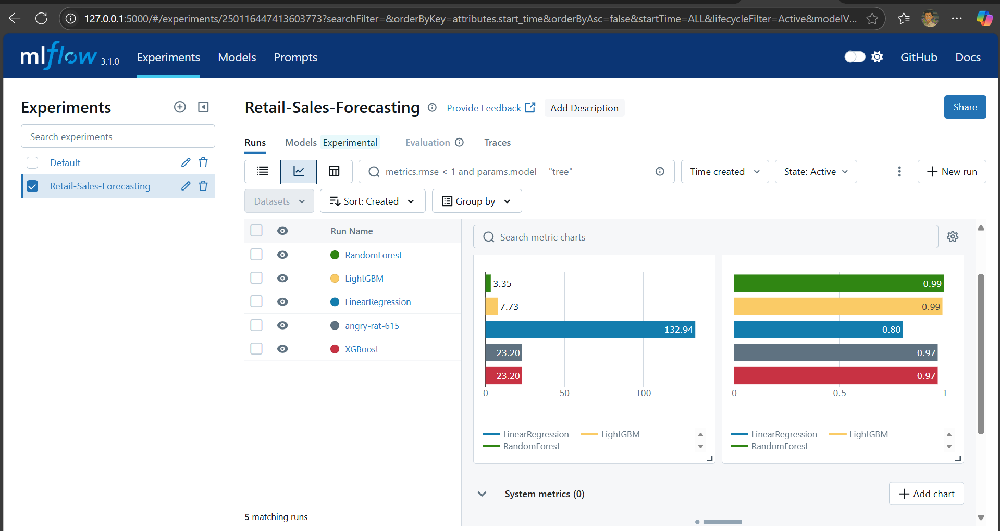
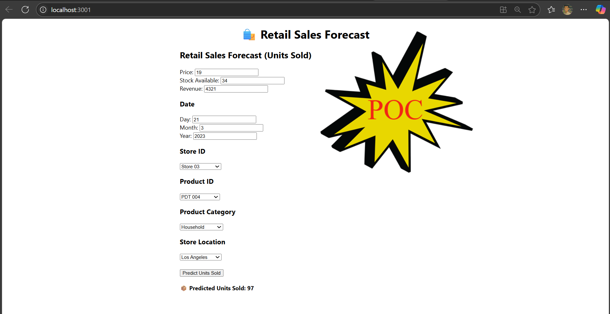
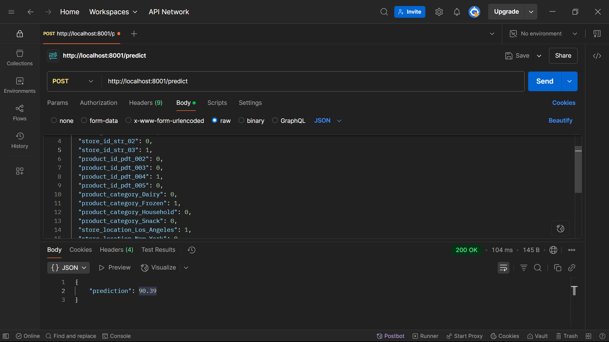

# 📦Retail Sales Forecasting Web App📈

#### Ever wondered how store managers decide how much stock to keep for tomorrow? 🤔
#### Well, I built a smart tool that predicts how many units of each product will sell on any given day helping stock management easier, avoiding overstocking or understocking.

## 📌 Features
- 🔍 Predict sales for specific product on a selected date
- 📊 Real-time ML predictions using trained Random Forest model
- 📁 MLflow integration to track and compare model performance
- 📦 Full-stack deployment using PM2 on AWS EC2 Ubuntu server
- 📱 Accessible from both mobile and desktop devices

## 🧠 Machine Learning
### ✔️ Models Trained
- Linear Regression
- LightGBM
- XGBoost
- Random Forest Regressor✅ (selected)

## 🏆 Why Random Forest?
#### After experimenting with different algorithms, Random Forest gave the best performance in terms of accuracy and generalization, especially on unseen data. It's also robust to overfitting and handles non-linear relationships well perfect for fluctuating sales data.



## 🔬 ML Experiment Tracking
- Track model parameters, metrics (MSE, R²)
- Compare different models visually
- Save the best-performing model

## 💻 Tech Stack
- 🐍 Python
- ⚡ FastAPI
- 🕸️React.js
- 🧪 MLflow
- ☁️ AWS EC2 (Ubuntu)
- Docker

## 📂 Project Structure
```
Retail_Sales_Forecast/
├── app/
│   ├── models/
│   │   ├── model_best.pkl
│   │   └── model_01.json
│   ├── main.py
│   ├── model_loader.py
│   ├── Scheme.py
│   └── requirements.txt
├── notebooks/
│   └── ... (MLflow runs and .ipynb files)
├── ui/
│   ├── public/
│   ├── src/
│   │   ├── App.js
│   │   ├── components/
│   │   │   └── FormComponent.js
│   ├── package.json
│   ├── build/
├── docker-compose.yml
```

## 🛠️ Installation & Usage

### 📍 Clone & Setup
```
git clone https://github.com/your-username/Retail_Sales_Forecast.git
cd Retail_Sales_Forecast
```
### ▶️ Backend (FastAPI)
```
cd app
python3 -m venv venv
source venv/bin/activate
pip install -r requirements.txt
uvicorn main:app --host 0.0.0.0 --port 8001
```
### ▶️ Frontend (React)
```
cd ui
npm install
npm run build
npx serve -s build -l 3000
```

## 🧑‍💻 How It Works
The model was trained using historical sales data of a retail store. Given a date and product, the backend loads the model and predicts expected sales. This helps decision-makers optimize stock levels by forecasting demand before the day arrives.

## 📸
### POC

### API Testing


## Who am I?
Are you curious learn from me 🙋‍♂️ [Fasin](https://fasinfasi.github.io/)
